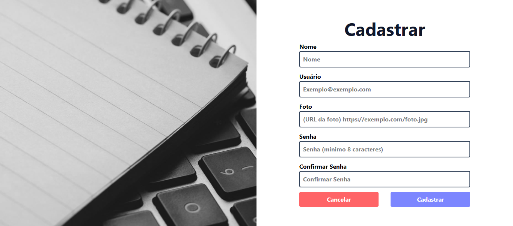
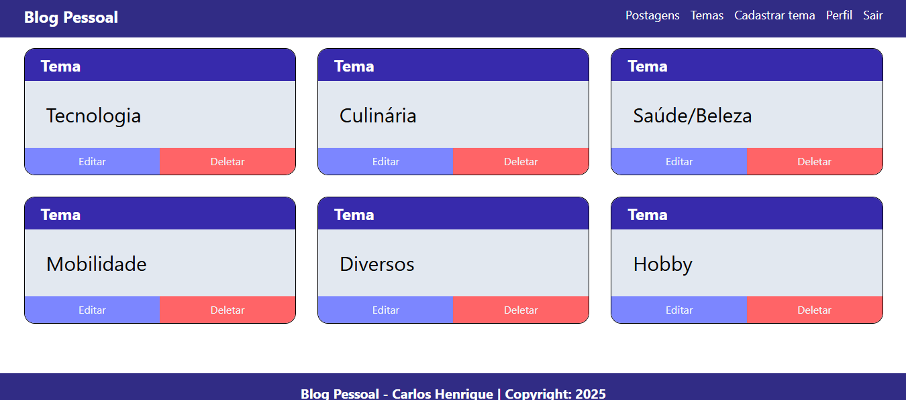
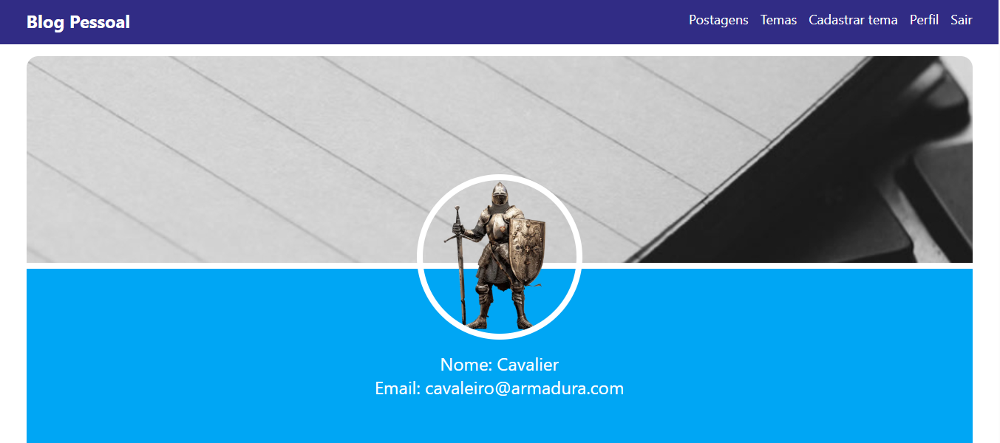
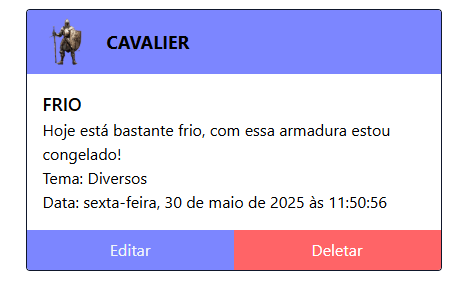
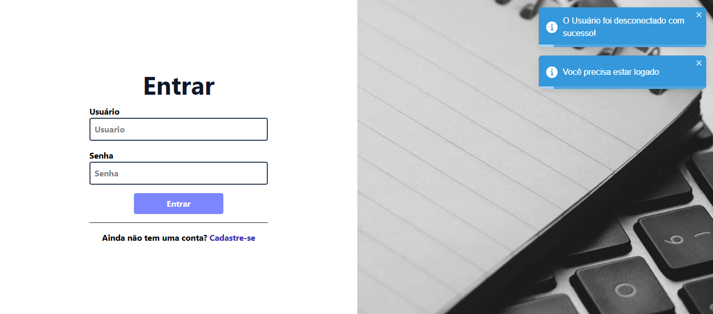

# Blog Pessoal 📝

Este é um projeto de Blog Pessoal desenvolvido com **React**, **TypeScript**, **React Router**, **TailwindCSS**, e integrações com uma API RESTful. Ele permite o cadastro e autenticação de usuários, além da criação, edição e remoção de postagens e temas.

---

✅ [Acesse a aplicação online](https://projeto-blog-pessoal-front-ebon.vercel.app/)

---

## 🧩 Sobre o Projeto

Este projeto consome uma API REST (já implementada no backend) e permite:

- **Cadastro e login de usuários**, com autenticação baseada em **token JWT**
- **Acesso protegido**: todas as páginas exigem login
- **CRUD completo** de:
  - **Postagens** (visíveis publicamente para usuários autenticados)
  - **Temas** 
- Interface responsiva e moderna, desenvolvida com **Tailwind CSS**
- Integração com **bibliotecas modernas de UI e utilitários**

---

## 🎯 Funcionalidades

- Cadastro de usuários
- Login com autenticação via token
- Criação, edição e exclusão de postagens
- Criação, edição e exclusão de temas
- Associação de postagens a temas
- Visualização de perfil com imagem e informações do usuário
- Feedbacks de ações com Toastify
- Responsividade para dispositivos móveis

---

## 🚀 Tecnologias e Bibliotecas

| Tecnologia           | Descrição                             |
|----------------------|---------------------------------------|
| React 19             | Framework principal SPA               |
| TypeScript           | Tipagem estática para segurança       |
| Vite                 | Ferramenta de build e dev server      |
| Tailwind CSS         | Estilização rápida e responsiva       |
| Axios                | Requisições HTTP                      |
| React Router DOM     | Roteamento de páginas SPA             |
| React Toastify       | Notificações toast                    |
| React Loader Spinner | Indicadores de carregamento           |
| ReactJS Popup        | Popups e modais interativos           |
| Phosphor Icons       | Ícones modernos e leves               |

---

## 🖼️ Prints do Projeto

### 📌 Tela de Cadastro

---

### 📌 Lista de Temas

---

### 📌 Página de Perfil

---

### 📌 Postagens

---

### 📌 Logout com Mensagem de Confirmação

---

## 🌐 Deploy

O frontend está hospedado com [Vercel](https://vercel.com/), com deploy contínuo a partir do repositório Git.

🔗 **Link para o app:** [https://projeto-blog-pessoal-front-ebon.vercel.app/](https://projeto-blog-pessoal-front-ebon.vercel.app/)

---

## 👨‍💻 Autor

Desenvolvido por Carlos Henrique.

---

## 📄 Licença

Este projeto está licenciado sob a licença MIT.
